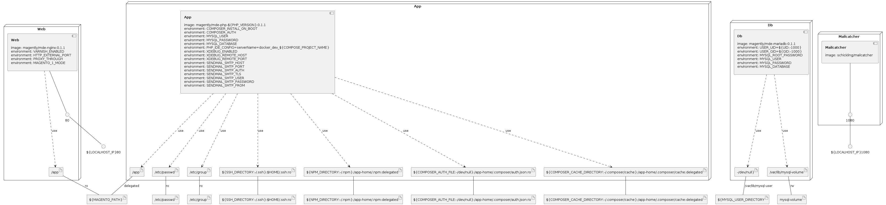

# Magento Developer Environment

A development environment for Magento on Docker and Docker Compose,
that is simple by default, yet still feature-rich.

## Features

- Wide range of supported PHP versions (5.6, 7.0, 7.1, 7.2, 7.3, 7.4),
- pre-built images, as well as customizable source code,
- using NGINX + FastCGI,
- MySQL storage using internal Docker volume, as well as user directory,
- support for non-standard HTTP ports,
- well-integrated with Composer,
- support for legacy Magento,
- built-in XDebug extension,
- optional proxying through third-party services,
- PHP's mail function to use any SMTP server,
- built-in NodeJS for assets compilation,
- easy setup using .env file,
- third-party services examples,

    - PHPMyAdmin,
    - Varnish,
    - Redis,
    - Elasticsearch,
    - Mailcatcher,

- flexible and highly customizable.

## How does it work?

The best way to figure out how the environment with all its features work,
is to examine `docker-compose.yml`, `docker-compose.override.yml` and images
source files (`docker/mariadb/`, `docker/nginx/`, `docker/php/`). The most
important thing to know is that, by default, it uses four services responsible
for different tasks:

- `app` container - includes PHP interpreter with extensions that Magento
    requires, PHP-FPM daemon for web server, tools such as Composer, NodeJS
    with NPM for assets building and some configurations
    to make custom features work,
- `web` container - includes nginx web server configured for Magento,
- `db` container - includes MariaDB database server with configuration
    to support flexible variable storage placement,
- `mailcatcher` - includes... MailCatcher. Review Magento configuration
    to make sure it does use MC and whether some additional SMTP modules
    should be left enabled.

## User manual

This environment mounts Magento directory within containers to make it easy
to work on. It can be used either with existing installation of Magento
or with a fresh directory to initialize new project.

1. Clone this repository anywhere you want. It's good practice to use every
    clone of the repo for each project, as it may contain settings
    corresponding to a single Magento installation.
2. Copy `.env.example` file as `.env`.
3. Optionally, copy `docker-compose.override.yml.example` file
    as `docker-compose.override.yml` and uncomment or modify contents of
    the copy to match your needs. **Warning**: for Magento 2.4,
    Elasticsearch must be enabled, preferably using this method.
4. Edit `.env` file to configure your installation. All variables that are
    uncommented by default are required or recommended (apart
    from `COMPOSER_AUTH`).
5. Make sure you have existing directories for Composer and NPM cache
    (`~/.composer/cache`, `~/.npm`) or point them to your
    custom directories in `.env`.
6. Make sure your `~/.ssh` directory exists.
7. Optionally validate your configuration by executing script in the
    environment's root directory.

    ```sh
    ./validate.sh
    ```

8. If you want to use pre-built Docker images (recommended), you need
    to pull them from Docker Hub:

    ```sh
    docker-compose pull
    ```

    If you want to build images by yourself, type:

    ```sh
    docker-compose build
    ```

9. Finally run the environment:

    ```sh
    docker-compose up
    ```

All containers that expose services do it on default ports (you can change
them by using `ports` settings in each container's definition in
`docker-compose.override.yml`):

| Service | Port |
| - | - |
| NGINX (application) | 80 |
| phpMyAdmin | 8336 |
| MailCatcher | 1080 |

A container that hosts MySQL doesn't expose any ports by default.

## Environment options

### General

- `COMPOSE_PROJECT_NAME`: variable used by `docker-compose`. Indicates the
    prefix for all Docker objects like containers, images and networks.
    Should be unique for a given project. Interfering project names will make
    the environment unable to initialize,
- `UID` and `GID`: Unix user and group identificators for new processes that
    may modify data in user directory. Should be the same as for the
    current user. You can check that using:

    ```sh
    id -u # for UID
    id -g # for GID
    ```
- `PHP_VERSION`: self explanatory. Can be one of:

    - 5.6,
    - 7.0,
    - 7.1,
    - 7.2,
    - 7.3,
    - 7.4,
    - 8.0,
    - 8.1,

- `PHP_EXTENSIONS`: a list of additional PHP extensions to be installed,
- `MAGENTO_PATH`: application directory. The path should be in UNIX format,
    though it can be relative or absolute. The directory may contain Magento
    files or be empty when initializing a new project. When using default mode,
    the `/pub` subdirectory will be used as a web server document root.
    When using `MAGENTO_1_MODE`, the directory will be document root itself,
- `LOCALHOST_IP`: a host IP address (`127.*.*.*`) to use for all services.

### MariaDB

- `MYSQL_ROOT_PASSWORD`, `MYSQL_USER`, `MYSQL_PASSWORD`, `MYSQL_DATABASE`:
    settings for the database server. Once `db` container is initialized,
    those values should *not* be changed, unless you plan to reinitialize
    MariaDB by deleting its files,
- `MYSQL_HOST` *(optional)*: you can use different database server providing
    a hostname. Note that the host must be accessible from the `app` container,
- `MYSQL_USER_DIRECTORY` *(optional)*: if set, `db` container will use
    provided path as variable storage for MariaDB server. This should be
    a UNIX-formatted path, and the directory has to exist and be writable
    by the current user. The database server daemon process will run
    on specified `UID` and `GID` permissions, so generated files will
    have the correct ownership and group.

If you also have a container hosting phpMyAdmin, use `MYSQL_USER`
and `MYSQL_PASSWORD` to log in.

### Composer

- `COMPOSER_VERSION`: version of Composer to be installed. You can set specific
    version, like `1.10.22`, or only major version, like `2` to install
    the newest available. Defaults to 2,
- `COMPOSER_AUTH_FILE` *(optional)*: JSON formatted file path to be mounted
    inside the `app` container to provide authentication credentials
    for Composer. See more
    [here](https://getcomposer.org/doc/articles/http-basic-authentication.md),
- `COMPOSER_AUTH` *(optional)*: instead of providing a file path, you may
    want to save the credentials directly in the `.env` file. The value should
    be a valid JSON inline string.
- `COMPOSER_INSTALL_ON_BOOT` *(optional)*: when set to true,
    the `composer install` command will be automatically triggered
    when the `app` container is starting,

### Mounted directories

You may want to customize some of the mounted directories - for example,
you may want to use a separate Composer cache directory for single Magento
project, or avoid mounting your `~/.ssh` folder by providing `/dev/null`
instead. You can change those using following variables:

- `SSH_DIRECTORY`,
- `NPM_DIRECTORY`,
- `COMPOSER_CACHE_DIRECTORY`.

### XDebug

By default, the `app` container entrypoint will try to guess how you run your
environment. If `host.docker.internal` hostname can be resolved, it will
be used.

Unfortunately, this doesn't work the same with every Docker Engine
implementation, and for now, it will only work this way on MacOS.
If it's not resolvable, `connect_back` mechanism will be used - which only
works on Docker on Linux. Connection target can be customized
using following vars, though:

- `XDEBUG_REMOTE_HOST` *(optional)*: target IP address of the host you're
    running your debugger at. This IP has to be reachable from the container.
    You may need to check your firewall settings if you're sure that's
    the correct address, but XDebug still can't connect.

- `XDEBUG_REMOTE_PORT` *(optional)*: by default it's 9000, but you can use
    any available port you like.

When using XDebug from container, you will also need to configure paths mapping
in your debugger. Inside the container, the app root that points
to `MAGENTO_PATH` is `/app`.

### Proxy through

This feature enables proxying HTTP traffic to your Magento instance through
a third-party service. It can be useful when there's a need to test
if a custom module behaves well with full page cache (like Varnish),
or you want to use a debugging or monitoring tool. The idea is to point where
the HTTP traffic has to go and then, on external service, go back
to the `web` container. Specifically, additional service has to proxy again
to `http://web:58080` in order to make it work.

- `PROXY_THOROUGH` *(optional)*: HTTP URL to use as a proxy. The service that
it points must be reachable by the `web` container. If you want to use Varnish
service definition from `docker-compose.override.yml.example`, this value
can be set to `http://varnish`.

### Sendmail SMTP

You might need to test outgoing emails, e.g. while coding a custom message
template. Magento uses
[PHP's `mail` function](https://www.php.net/manual/en/function.mail),
which then calls system command (by default it's `sendmail`) to send
the message. The environment uses [MSMTP](https://marlam.de/msmtp/) client
allowing you to use any SMTP server for the delivery.

The `docker-compose.override.yml.example` contains
[Mailcatcher](https://mailcatcher.me/) service, which is very convenient,
because it catches every single email, no matter where it's being sent.
Some external SMTP servers like [Mailtrap.io](https://mailtrap.io/) can be
used as well. The configuration will be set in the container only
if the `SENDMAIL_SMTP_HOST` is defined.

- `SENDMAIL_SMTP_HOST` *(optional)*: can be a name of `docker-compose` service
    or any external host name/IP,
- `SENDMAIL_SMTP_PORT` *(optional)*: SMTP server port number (default: 25),
- `SENDMAIL_SMTP_AUTH` *(optional)*: can be `on` or `off` (default: `off`),
- `SENDMAIL_SMTP_TLS` *(optional)*: can be `on` or `off` (default: `off`),
- `SENDMAIL_SMTP_USER` *(optional)*: SMTP username (default: `user`),
- `SENDMAIL_SMTP_PASSWORD` *(optional)*: SMTP password (default: `password`),
- `SENDMAIL_SMTP_FROM` *(optional)*: default is `magento@internal.app`.

## Interacting with containers

For common tasks like Composer package management or dealing with Magento
configuration, we use CLI interface. We need to do that from within
the container in order to use the proper PHP version, access the database
and use the same PHP configuration as the Magento accessed through
the web server.

For the sake of simplicity, we only talk
to the `app` container.

### Attaching to the `app` container

You can run bash session inside app container with a simple call

```sh
docker-compose exec app bash
```

or you can run a command directly by replacing `bash` with whatever command
you want to execute. By default, it will always use the defined `MAGENTO_PATH`
as a working directory. For example you can run every Magento CLI
command by calling:

```sh
docker-compose exec app php bin/magento [...]
```

### Importing MySQL database

```sh
docker-compose exec -T app mysql < /path/to/file.sql
```

### Exporting MySQL database

```sh
docker-compose exec -T app mysqldump db-name> /path/to/file.sql
```

### NodeJS and NPM

The `app` container has both `node` and `npm` commands available.
Currently, it uses NodeJS v12 LTS.

```sh
# Install Node modules
docker-compose exec app npm i

# Run a Grunt task
docker-compose exec app node_modules/grunt/bin/grunt watch
```

### Mapping ports

If you'd like to access the container's internal service port, but using
a different host-bound port, the easiest way to achieve this is through
additional configuration in `docker-compose.override.yml`. For example, to
access the `db` container from MySQL client installed on host machine, provide
this configuration (remember to always include local host IP):

```yml
services:
    db:
        ports:
            - 127.0.0.1:33060:3306
```

## Quirks

### Elasticsearch container exiting with error regarding `vm.max-map-count`

If you're experiencing errors regarding
`vm.max-map-count`, [read this](https://www.elastic.co/guide/en/elasticsearch/reference/6.8/vm-max-map-count.html)
to learn why you need to adjust host system's kernel configuration
through, for example, such file:

```ini
# /usr/lib/sysctl.d/90-max-map-count.conf

vm.max_map_count = 262144
```

To reload kernel configuration without reboot, run:

```sh
sudo sysctl --system
```

### Elasticsearch settings for `ulimits`

Official [guide for using Elasticsearch](https://www.elastic.co/guide/en/elasticsearch/reference/current/docker.html)
contains sample configuration that includes setting `ulimits` for the container.
This is in order to increase stability and performance by disabling swapping.
Without these settings, the container may exit after some time - usually
i takes around a minute.

There were situations, though, when not setting these limits didn't cause the
container to exit and there weren't any performance issues. If you have any
of them, include these limits in `docker-compose.override.yml` - refer to
example `docker-compose` configuration file.


### Infrastructure model

